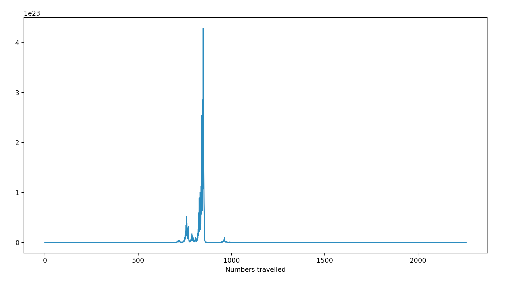
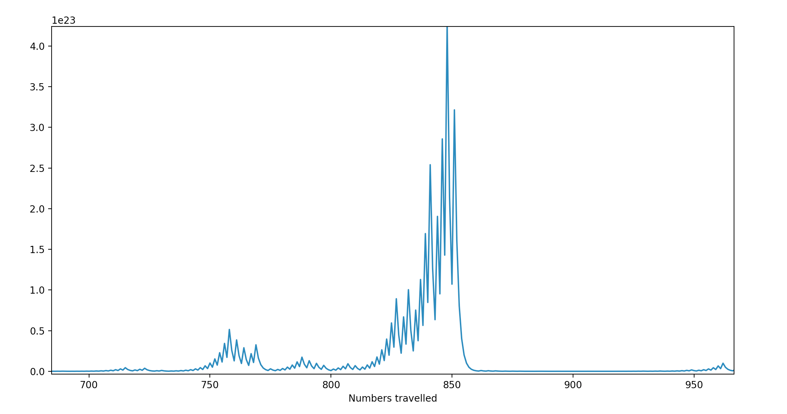

# Collatz Conjecture
Collatz Conjecture as said on wikipedia
> The Collatz conjecture is a conjecture in mathematics that concerns a sequence defined as follows: start with any positive integer n. Then each term is obtained from the previous term as follows: if the previous term is even, the next term is one half the previous term. Otherwise, the next term is 3 times the previous term plus 1. The conjecture is that no matter what value of n, the sequence will always reach 1.

This program is performed on number ` 279731,455495,736617 `. Here are some stats.
* Total steps to reach One `2258`
* Time taken `0.08700323104858398s`

Pattern

Zoomed version

